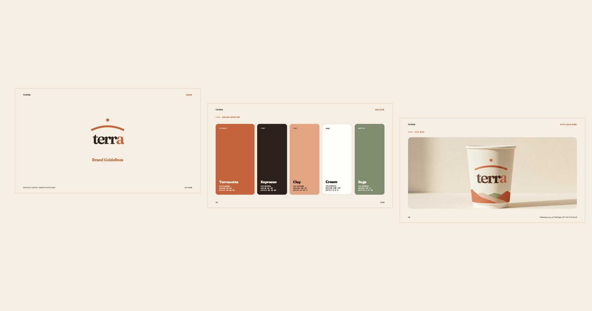
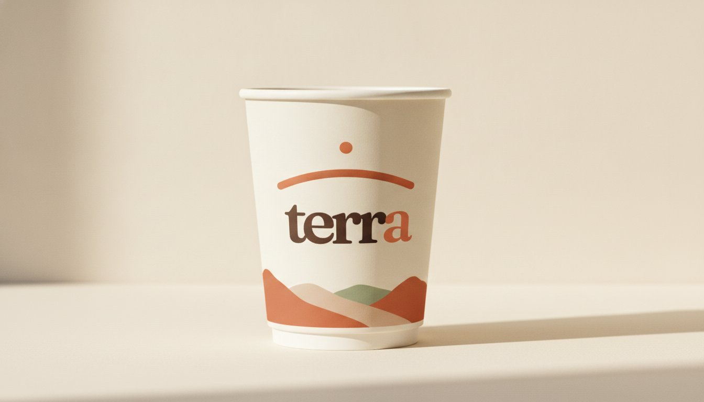
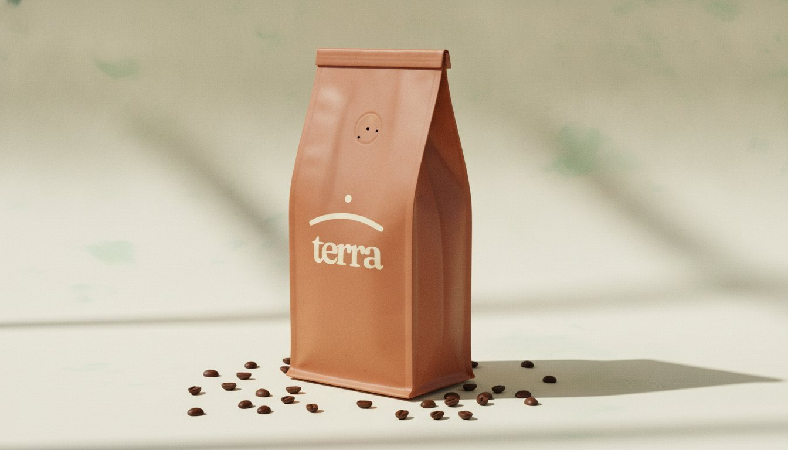
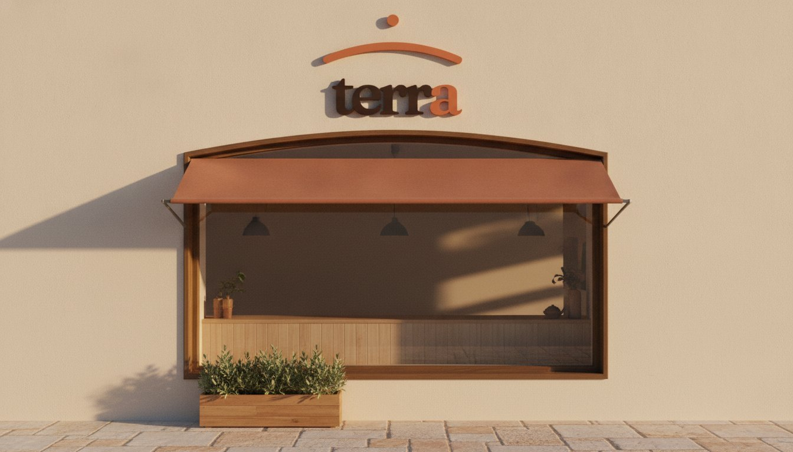
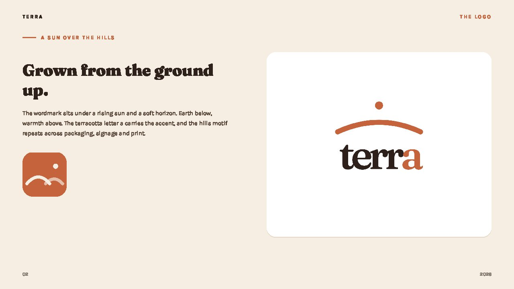
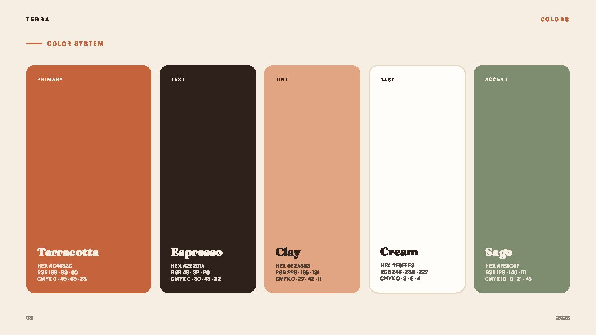
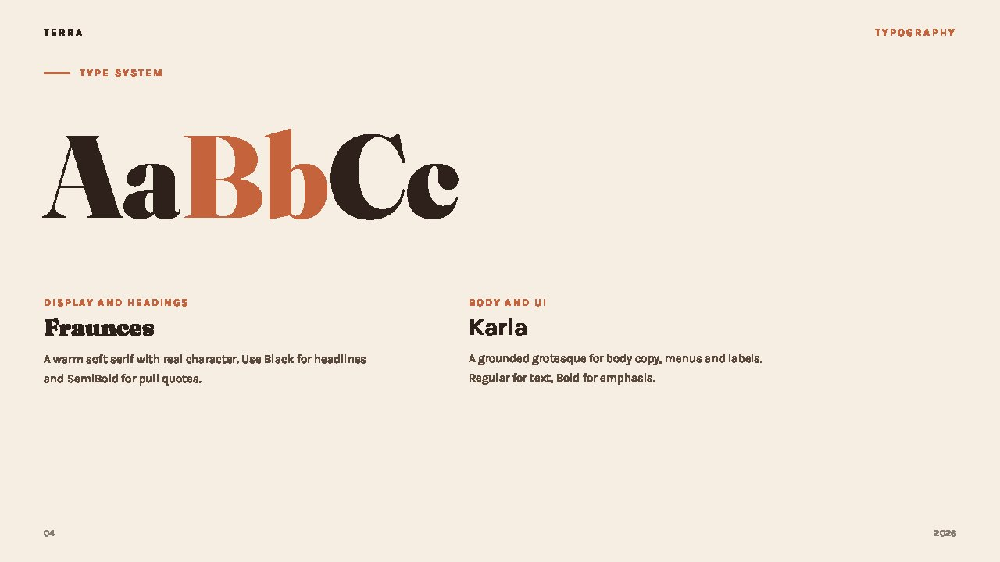
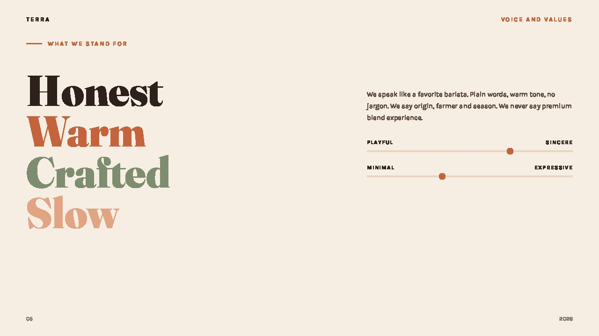

<div align="center">



# Brand Identity Generator

**A Claude Code skill that designs a complete, agency-grade brand identity — logo system, colors, typography, voice, and real AI product mockups — delivered as a polished 16:9 brand guidelines deck (HTML + PDF).**

[Live generator studio](https://brand.sadaorg.com/) ·
[The skill](skill/SKILL.md) ·
[Example output](examples/terra/)

**Install in one line:**

```bash
curl -fsSL https://brand.sadaorg.com/install.sh | bash
```

</div>

---

## What it makes

Give it a logo (or nothing at all) and a short brief. It produces:

| Deliverable | Details |
|---|---|
| **Brand guidelines deck** | 10 to 45 slides, landscape 16:9, self-contained HTML exported to PDF |
| **Logo system** | Wordmark, symbol, app badge, white/dark variants, clear space and misuse rules |
| **Color system** | Swatches with HEX / RGB / CMYK, roles (primary, tint, text, base, accent) |
| **Typography** | Display + body pairing, specimens, bilingual (e.g. Arabic + Latin) support |
| **Voice & values** | Personality sliders, say / don't say, values typography |
| **Real product mockups** | AI-photographed applications: cups, packaging, storefronts, business cards, uniforms, billboards — with **your actual logo composited in**, never redrawn |

Every image below was generated by the skill for **terra**, a fictional demo coffee brand — from logo to storefront in one session:

<p align="center">
  
  
  
</p>

<p align="center">
  
  
  
  
</p>

Full example deck: [`examples/terra/Terra-Brand-Guidelines.pdf`](examples/terra/Terra-Brand-Guidelines.pdf)

## How it works

1. **Brief** — You tell Claude the brand name, market, audience, and vibe (or try the [live studio](https://brand.sadaorg.com/) first for a quick taste). Upload a logo, or let the skill design one and show you 6 to 8 options.
2. **Foundations** — The skill locks the logo, samples/derives a palette, picks a type pairing, and confirms direction with you *before* building 30+ slides.
3. **Mockups** — Real product photos are generated with your actual logo passed as a reference image to gpt-image-1 (`/v1/images/edits`, high input fidelity), plus flat illustrations and patterns (`/v1/images/generations`). Guards prevent redrawn letters and AI-invented gibberish text.
4. **Deck & review** — Everything is composed into one self-contained HTML deck, printed to PDF via headless Chrome, then every page is rasterized and visually reviewed before delivery.

## Install

Any ONE of these — all end with the skill in `~/.claude/skills/brand-identity/`:

```bash
# 1. one line, from the website
curl -fsSL https://brand.sadaorg.com/install.sh | bash

# 2. one line, straight from GitHub (no third party server involved)
curl -fsSL https://raw.githubusercontent.com/AbdulkareemKR/brand-identity-generator/main/install.sh | bash

# 3. manual — note the skill lives in the repo's skill/ folder, not the repo root
git clone --depth 1 https://github.com/AbdulkareemKR/brand-identity-generator.git /tmp/big \
  && mkdir -p ~/.claude/skills && cp -R /tmp/big/skill ~/.claude/skills/brand-identity && rm -rf /tmp/big
```

Or [download the zip](https://brand.sadaorg.com/brand-identity-skill.zip) and unzip it into `~/.claude/skills/`.

Then in [Claude Code](https://claude.com/claude-code):

```
create a brand identity for my coffee shop "terra" — earthy, artisanal, warm
```

The skill triggers on: *brand identity, brand guidelines, design system, brand book, style guide, brand deck, logo design*.

## Keys

| Env variable | Used for | Required? |
|---|---|---|
| `OPENAI_API_KEY` | ALL AI mockups (gpt-image-1: logo-bearing product edits + flat illustrations and patterns) — [get one](https://platform.openai.com/api-keys) | Optional, recommended |

```bash
export OPENAI_API_KEY="..."   # add to ~/.zshrc or ~/.bashrc
```

One key, one model. No Gemini key needed.

No keys? The deck still builds — logo, colors, type, voice, and vector slides render free via headless Chrome. You only lose the AI photo mockups.

Also needed locally: Google Chrome (PDF export), Python 3 with Pillow (`pip install pillow`, used for logo processing and the review pass).

## Repo layout

```
skill/SKILL.md            the skill — copy of what runs in Claude Code
skill/scripts/            process_logo.py (logo → clean PNG set + palette)
                          gen_mockups.py  (AI mockup generation template)
examples/terra/           full demo: assets, deck HTML, PDF, mockups
docs/                     the website (GitHub Pages)
```

## Why the output doesn't look AI-generated

The skill encodes hard-won craft rules: one product per application page with multiple angles, ghost mannequins instead of people, "absolutely no text" guards against gibberish, real logo compositing instead of redrawing, print-safe CSS, a mandatory page-by-page visual review, and an anti-slop test — *"could someone tell an AI made this?"* If yes, it pushes harder.

## License

[MIT](LICENSE) — use it for client work, commercial brands, anything.
